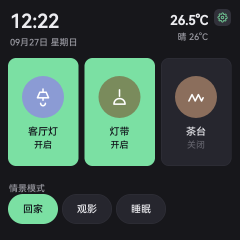
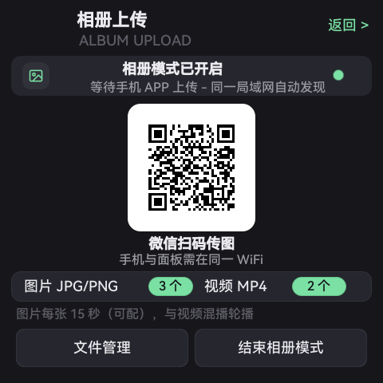
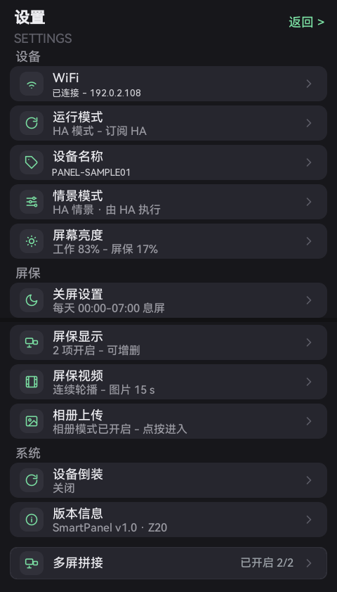
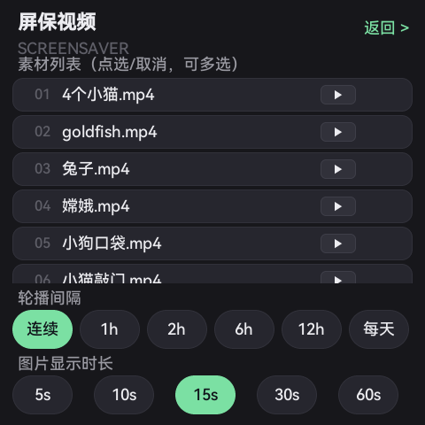
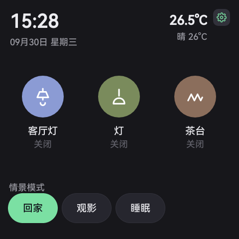
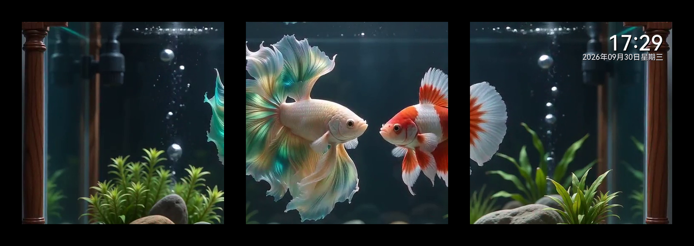

# SmartPanel — 86-box Smart Home Panel (FlyThings / SigmaStar SSD20x)

[中文](README.md) ｜ **English**

A **4-inch 480×480 Linux touch panel** built into a standard 86-box:
**3 × 10 A relays**, scene linkage, works as a **Home Assistant terminal** or as a local
host itself; plus idle clock/photo frame, night-time screen-off, one-tap 180° flip,
and **multiple panels tiled into one video wall**.

> License: **MIT** (see `LICENSE`). Third-party deps and redistribution notes:
> `THIRD_PARTY_LICENSES.md`. Release process & open decisions: `PUBLISH.md`.

---

<table>
  <tr>
    <td align="center"><br><sub><b>Home</b><br>3 relays + scenes</sub></td>
    <td align="center"><br><sub><b>Album</b><br>scan to upload</sub></td>
    <td align="center"><br><sub><b>Settings</b><br>all features at a glance</sub></td>
    <td align="center"><br><sub><b>Screensaver</b><br>video / photo rotation</sub></td>
    <td align="center"><br><sub><b>HA config</b><br>scan &amp; paste token</sub></td>
  </tr>
  <tr>
    <td colspan="5" align="center"><br><sub><b>3-screen video wall</b> · one clip split per panel, phase-aligned + time-synced (1×3, 52 px discarded between panels, clock at the top-right of the rightmost screen)</sub></td>
  </tr>
</table>

---

## 0. Dependency: FlyThings MCP (**release version**)

Secondary development (build / debug / packaging / knowledge base / device tools) is based on
**FlyThings MCP**. Its **release version is maintained and published separately** — this repo only
references it, never vendors it.

| Purpose | Location |
|---|---|
| **Release version (where users get it)** | `https://github.com/KWolve/FlyThingsMCP` |
| China mirror (Gitee) | `https://gitee.com/Kwolve/flythingsmcp_release` |
| Local path (same workspace, for verification) | `tools/FlyThings_mcp_release/` |

Install / integration steps follow that release repo's README (plug the MCP into your AI client).

---

## 1. Features

| Module | Description |
|---|---|
| 3 relays | Renameable (living room / strip / tea table); touch, scene linkage and HA commands share **one source of truth** (`RelayManager`) |
| 3 run modes | ① **HA mode**: external broker (HA MQTT Discovery auto-creates 3 switch entities) ② **Local master**: on-panel MQTT broker, slaves/mini-program connect directly ③ **Local slave**: connects to the master's broker |
| Scenes | Built-in scene table (home/away/sleep/relax); HA can push a scene list and trigger them |
| Clock / Album | Idle 15 s → clock / photo frame; **scan-to-upload** (QR generated on-device by the QR control) |
| Screen-off window | e.g. 20:00–08:00 full black, touch to wake |
| Flip 180° | Screen + touch layer rotate together (no need to unmount on site) |
| Video wall | Split one video per panel, **phase-aligned + time-synced**; multi-clip playlist; **no external server** (master broadcasts epoch) |
| Local hub | Standalone MQTT broker on the panel (QoS1 / Will / retained, RSS ~1 MB) |

## 2. Hardware / platform

- Platform: **Z20 / SigmaStar SSD201·SSD202D** (dual Cortex-A7 @1.2 GHz, 128 MB DDR3, 16 MB NOR + 128 MB SD NAND)
- Display: 480×480 (720×720 in the same family); product model SW48480040D1
- Power: AC220V / DC9-24V; RS485 + 100M Ethernet; 3 × 10 A relays
- OS: FlyThings V2.1 + EasyUI (`/res` read-only squashfs, `/data` 512 KB, `/mnt/sdnand` 74 MB rw)

## 3. Layout

```
src/
  Main.cpp                 entry point
  activity/                main activity
  logic/                   page logic (home/main/settings/scenes/album/video/wall/off…)
  device/                  RelayManager (single source of truth), SensorManager
  network/                 MqttBridge (HA mode), LocalLink (local master/slave),
                           MiniBroker (embedded fallback), LocalBrokerService,
                           WebConfigServer (on-panel config web page), PanelLink, TcpReceive
  storage/ConfigStore      all persisted settings (prefs)
  wall/                    video wall (WallLink clock sync / WallPlayer playback)
ui/                        *.json layouts + *.ftu artifacts (built by `fui pack`)
resources/images/          UI image assets
font/                      Chinese fonts (trimmed font set: no emoji / special symbols)
tools/                     video-wall splitter (web UI), factory defaults, host-side smoke tests
docs/                      release notes / manuals / wall guide / HA config / Domoticz / factory defaults
```

## 3.1 HA / MQTT server configuration (scan a QR code — nothing hard-coded)

Broker address, username and token have **no built-in defaults** (no LAN addresses in code).
On the panel: **Settings → Run mode → HA mode** — a QR code appears; scan it with your phone to open
the **on-panel web page** (`http://<panel-ip>:8080/<code>/`), paste the long token and save.
The panel reconnects immediately. Credentials stay in local prefs only. See `docs/HA-CONFIG-WEB.md`.

**Mass production**: drop `panel-defaults.json` (broker, etc.) into `/mnt/sdnand` or ship it in
`/res/etc` — the device applies it to prefs on first boot. See `docs/FACTORY-DEFAULTS.md`.

## 4. Build & deploy

```bash
fun install                                   # fetch dependencies (re-run after editing Manifest)
fun build -p Z20                              # → .fun/z20 (or .fsc/z20) libzkgui.so
fun pack -p Z20 --startup-dir /res --release-version 1.0.N   # build update.img (USB/TF upgrade)
```

Hot-swap during development (keeps system partitions untouched; a power cycle reverts):

```bash
adb push libzkgui.so /tmp/lib/libzkgui.so
# point startupLibPath in /tmp/EasyUI.cfg to /tmp/lib/libzkgui.so (must be BOM-free!)
adb shell "setprop ctl.restart zkswe"
```

⚠️ Push a busybox first for on-device debugging: `adb push tools/busybox/bin/z20/busybox /tmp/busybox`
(the device shell lacks free/grep/nohup).

## 5. MQTT topics

```
smartpanel/<deviceId>/availability                  online / offline (LWT)
smartpanel/<deviceId>/status                        device status JSON (retained)
smartpanel/<deviceId>/switch/relay_<1..3>/state     relay state ON/OFF (retained)
smartpanel/<deviceId>/switch/relay_<n>/command      external command ON/OFF
smartpanel/broadcast/scene                          local mode: scene activation
smartpanel/ha/scenes                                scene list pushed by HA (retained)
homeassistant/switch/<uid>_<relay>/config           HA Discovery (HA mode)
```

## 6. Video wall (web-based splitter)

```bash
python tools/video_wall/web/server.py --port 8796     # open http://<PC>:8796/
```
Drag a box per screen (each screen's window can be moved independently) → export
`c1/seg_1..N.mp4 + playlist.json` → **one-click distribute** to all panels.
Measured setup: **1×3 horizontal, 52 px discard between screens, screensaver clock at the
top-right of the rightmost screen** (see the composite in `docs/发布说明.md`).

## 7. Verification

- Panel UI pixel diff: `tools/ui_tools/ui_diff.py` (±2 tolerance)
- On-panel web config: `tools/webcfg_test/` (x86 stub smoke test, no device needed)
- Multi-device batch: MCP `flythings_test_run` (case JSON + logcat assertions)

## 8. Open-source status

- [x] **License: MIT** (see `LICENSE`); the on-panel broker service is MIT as well
- [x] No credentials/LAN info in code: broker address, MQTT password and mini-program AppID defaults cleared
- [x] Sample configuration points nowhere internal: defaults are empty; configure by QR or factory defaults
- [x] Third-party dependency list & licenses: `THIRD_PARTY_LICENSES.md` (with items to confirm)
- [x] Release checklist & sanitization record: `PUBLISH.md`; release notes: `docs/发布说明.md`
