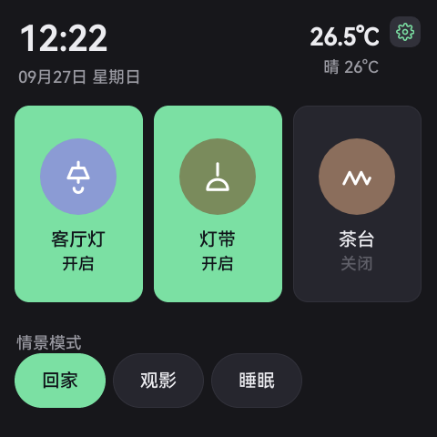
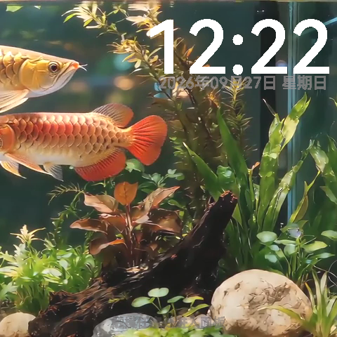
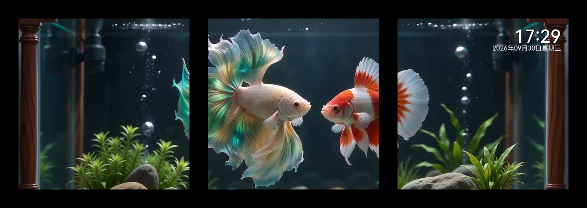
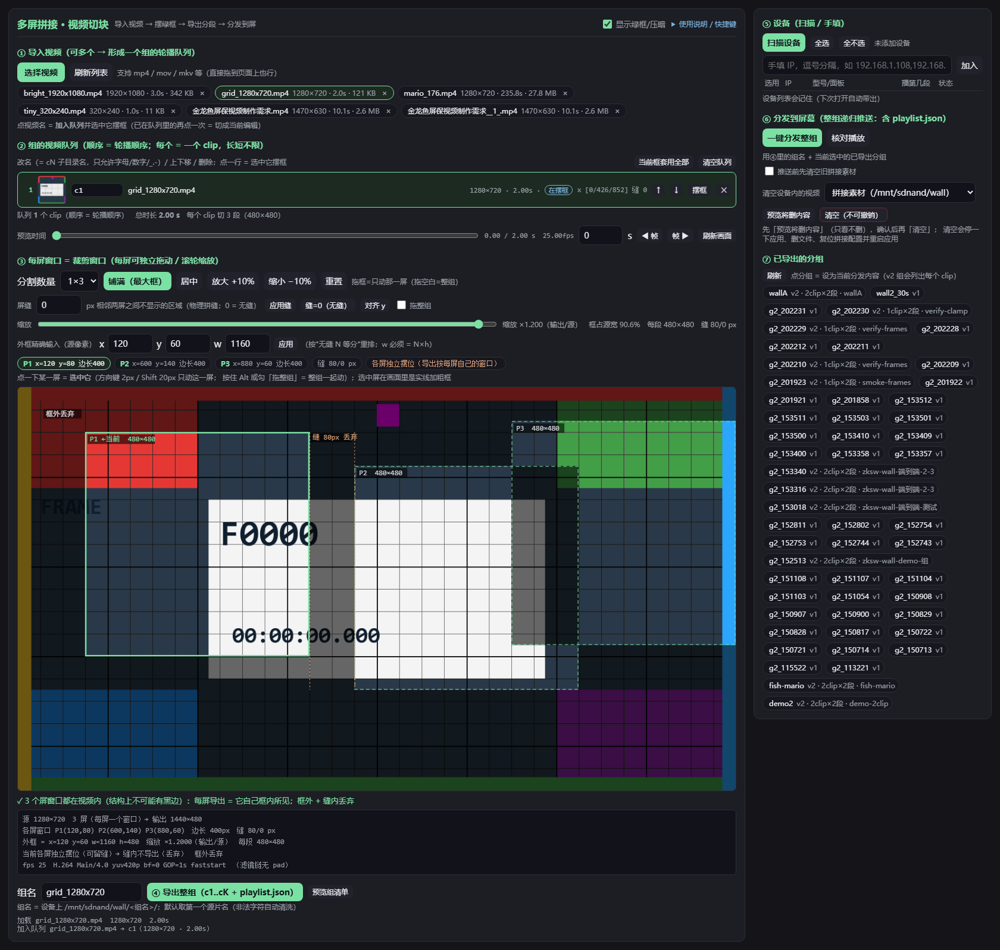
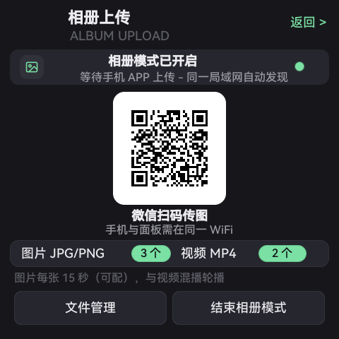
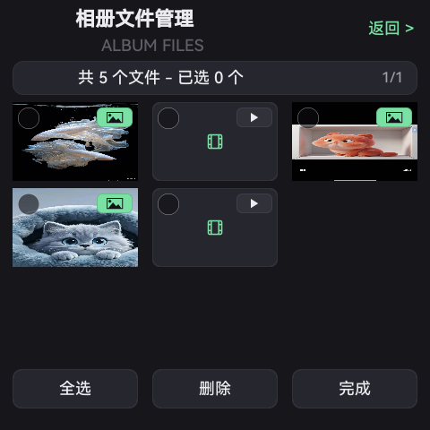
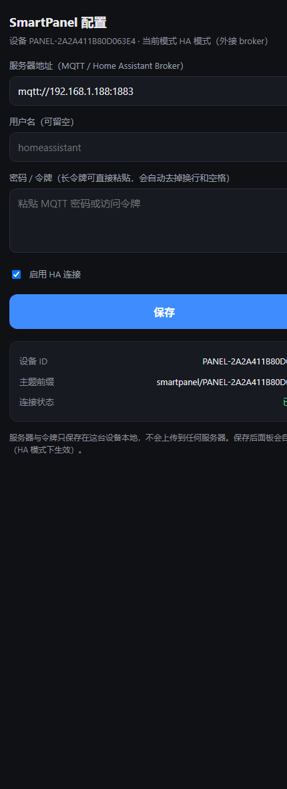

# SmartPanel 发布说明（Z20 / SSD20x 智能面板）

> 一块装在 **86 盒**里的 **4 寸 480×480** 触摸面板：**3 路 10 A 继电器**、**原生接入 Home Assistant**、
> **多台拼成一堵视频墙**、**扫码传图当相册**，外加时钟屏保、熄屏时段、一键倒装。
>
> 本文给"第一眼就想看效果"的人：**先看效果图，再看怎么用**。

---

## 依赖：FlyThings MCP（**release 版**）

本工程的二次开发（编译 / 调试 / 出包 / 知识库 / 设备工具）依托 **FlyThings MCP**；
其 **release 版本单独维护、单独发布**，本仓只引用、不复制：

| 用途 | 位置 |
|---|---|
| **release 版（用户获取 / 安装处）** | `https://github.com/KWolve/FlyThingsMCP` |
| 国内镜像（Gitee） | `https://gitee.com/Kwolve/flythingsmcp_release` |
| 本机路径（同工作区校验用） | `tools/FlyThings_mcp_release/` |

安装与接入方式以该 release 仓的 README 为准。

---

## 0. 一眼看效果

| 主界面（3 路开关 + 情景） | 屏保（时钟 / 天气 / 相册） |
|---|---|
|  |  |

| **3 屏互联拼接**（横排 1×3 = 一整幅画面） | **HA 配置只需扫码** |
|---|---|
|  |  |

> 上图 = 三段素材（按**列**切成左/中/右）**横向拼成一整幅画面**：
> - **黑框铺满**：画布纯黑，无灰色外壳/高光边
> - **间隙统一**：机间间隙与四周留边**同为 52 px**（= 该组 `wall.json` 的 `seam_w: 52`）
> - **屏保时间**：叠在**最右屏的右上角**（时间 + 日期，用设备同款字库渲染，风格与面板一致）
> - 画面取各屏**屏保态**（拼接视频播放中）一帧；对照：竖排版 = `05b_wall_3split_v.png`，
>   丢 0 的无缝版 = `05d_wall_3split_h_nogap.png`
> - 对照版：全 52 口径（黑边也 52）= `release_shots/05e_wall_3split_all52.png`；
>   无缝版（丢 0、画面连续）= `release_shots/05d_wall_3split_h_nogap.png`；竖排现场装法 = `05b_wall_3split_v.png`

---

## 1. 三大核心能力

### 1.1 强大的 **HA 基础功能**（标准 MQTT，开箱即用）

- **零开发接入**：面板走 **HA MQTT Discovery** 标准协议 —— 上电连上 broker 后，HA 里**自动出现 3 个开关实体**
  （名字 = 面板上给继电器起的名字：客厅灯 / 卧室灯 / 灯带）。
- **双向同源**：HA 点开关 → 面板继电器动作；面板触摸 → HA 状态同步（retained，状态以板内 `RelayManager` 为唯一事实源）。
- **可用性**：LWT 上报 `online/offline`，HA 侧能看出面板在线状态。
- **情景交给 HA**：面板从 HA 读取情景清单（`smartpanel/ha/scenes`）显示成卡片，点击反向触发 HA 自动化；
  HA 侧还能回报"当前情景"，面板卡片高亮。
- **配置用手机扫码**：面板「运行模式 → HA 模式」显示二维码，手机扫码打开**板内配置网页**，
  粘贴 broker 地址与令牌即可（见 §2）。
- **兼容 Domoticz**：Domoticz 的 `MQTT Auto Discovery`（硬件类型 htype=125）同样吃这套报文 ——
  实测 3 路开关实体正常生成、Domoticz 侧点开关面板继电器动作、温湿度类传感器报文也能被建出来。
  详见 `docs/DOMOTICZ-COMPAT.md`。

### 1.2 **3 屏互联拼接**（一堵墙 = N 块面板）

- **原理**：一条"整墙"视频横向切成 N 段（每段 = 单屏 480×480），每台面板播自己那段；
  **主机广播时间基准（epoch）+ 整边界起播**，从机对齐 → 拼起来是一条连续画面。
- **网页端切块工具**（PC 浏览器里所见即所得）：

  

  - 拖绿框选画面区域（**每屏框可独立拖动**，用于补偿物理拼缝；滚轮/缩放条改整组大小）
  - **屏缝预设**：`屏缝` 输入框 = 相邻两屏之间的实物拼缝（px），缝内的源画面不导出；
    **默认 0**（= 无缝拼接，画面连续）；实测物理缝宽后填对应值即可，下一版会把它做成**下拉预设**
  - **黑边口径**：屏幕自带的黑边外框由面板硬件决定，**不参与切块**（切块只处理画面区域）；
    发布说明里的效果图按预设黑边（默认 14 px）绘制，仅用于展示实物观感
  - 一个组可放**多个视频轮播**（每段各自摆框，时长不限）
  - 导出 → `c1/seg_1..N.mp4 + playlist.json`，再**一键分发**到 N 台设备（自动写 `sp_wall_*` 配置）
  - 启动：`python tools/video_wall/web/server.py --port 8796` → 浏览器打开 `http://<PC>:8796/`
- **面板侧配置**：组名 / 第几屏 / 总屏数 / 角色（主机·从机）/ 段时长 / 本屏素材（设置页「多屏拼接」行）。
- **实测**：3 台（2 台从机 + 1 台主机）连续播放、相位对齐、拼缝不明显（效果见图 §0）。

### 1.3 **相册功能**（扫码传图 + 屏保播放）

| 相册（扫码上传） | 相册文件 |
|---|---|
|  |  |

- 面板显示二维码 → 手机扫码打开上传页（或微信小程序）→ 照片进面板，屏保轮播。
- 素材也可直接放 **TF 卡 / U 盘**（`/mnt/extsnand`、`/mnt/usb*` 下的图片/视频目录）。
- 轮播节奏可配：**图片每张 N 秒**（默认 15 s）、**视频间隔**（0 = 播完即切）。

---

## 2. HA 配置方法（现场 3 步）

> 前提：面板和 HA 在同一局域网；HA 已配置 MQTT 集成并连上一台 broker（如 EMQX / Mosquitto）。

**第 1 步 · 面板选 HA 模式**
设置 → 运行模式 → 选 **HA 模式** → 面板下方出现二维码与网址。

**第 2 步 · 手机扫码填服务器**（这就是二维码里的板内网页）



- **服务器地址**：填 broker，如 `mqtt://192.0.2.188:1883`（只写 `192.0.2.188` 会自动补 `:1883`）
- **用户名 / 密码（令牌）**：按 broker 要求填；**长令牌直接粘贴**（自动去掉换行空格）
- 点**保存** → 面板立刻重连，页面上的「连接状态」会变成 **已连接**

**第 3 步 · HA 里收实体**
HA → 设置 → 设备与服务 → MQTT → 自动出现设备 **SmartHomePanel**（名字 = 面板「设备名称」），
带 **3 个开关**（客厅灯 / 卧室灯 / 灯带）＋ 可用性状态。点开关即可控灯。

**要改服务器/口令**：重复第 2 步即可（扫码 → 改 → 保存），不用拆机、不用电脑。

> 现场默认值：量产/固化时可带一份 `panel-defaults.json`（放 `/mnt/sdnand` 或 `/res/etc`），
> 设备首次开机会自动写进配置 —— 这样**开箱不配置也能上 HA**。见 `docs/FACTORY-DEFAULTS.md`。

---

## 3. 其他功能一览

| 分区 | 功能 | 图 |
|---|---|---|
| 继电器 | 3 路 10 A，每路可改名；断电记忆；主界面可按键隐藏/重排 | `manual_shots/02_主界面.png` |
| 情景 | 本机情景表（回家/离家/睡眠/休闲）；HA 模式由 HA 管理 | `manual_shots/06_情景模式.png` |
| 屏保 | 时钟 + 日期 + 温湿度 + 天气 + 状态栏（项可增删、可拖动摆位） | `manual_shots/09_屏保显示.png` |
| 屏保视频 | 选一段视频当屏保，设轮播间隔 | `manual_shots/10_屏保视频.png` |
| 熄屏时段 | 例 20:00–08:00 整块黑屏，触摸唤醒 | `manual_shots/08_关屏设置.png` |
| 屏幕亮度 | 工作亮度 / 屏保亮度分开设 | `manual_shots/07_屏幕亮度.png` |
| 一键倒装 | 整屏 + 触摸层一起转 180°，现场装机不用拆 | `manual_shots/13_设备倒装_开启.png` |
| 设备名称 | 改名字（同步到 HA 设备名） | `manual_shots/15_设备名称.png` |
| 配网 | 系统 WiFi 页 | `manual_shots/16_WiFi设置.png` |

---

## 4. 部署与运维

| 事项 | 说明 |
|---|---|
| 编译 | `fun install` → `fun build -p Z20`（产物 `libzkgui.so`） |
| 调试期部署 | 推 `/tmp/lib/libzkgui.so` + `/tmp/EasyUI.cfg` → `setprop ctl.restart zkswe`（**不动系统分区，断电回落原厂**） |
| 固化发布 | `fun pack -p Z20 --startup-dir /res --release-version 1.0.N` → `update.img`（U 盘/TF 升级） |
| 出厂默认 | `tools/provision_factory_defaults.py`（broker 等）见 `docs/FACTORY-DEFAULTS.md` |
| 验收 | UI 像素：`tools/ui_tools/ui_diff.py`；多设备：`flythings_test_run`；broker：`projects/z20_local_hub/tools/*` |

**MQTT 主题约定**

```
smartpanel/<deviceId>/availability                   online / offline（LWT）
smartpanel/<deviceId>/switch/relay_<1..3>/state      ON / OFF（retained）
smartpanel/<deviceId>/switch/relay_<n>/command       外部命令 ON / OFF
smartpanel/<deviceId>/status                         面板整体状态 JSON
smartpanel/broadcast/scene                           本机模式：情景广播
smartpanel/ha/scenes                                 HA 下发情景清单（retained）
homeassistant/switch/<uid>_relay_<n>/config          HA Discovery
```

---

## 5. 已知限制 / 注意

- 面板本体**没有温湿度传感器**（屏保数据来自网关推送/接口）；如需"传感器进 HA"，由传感器侧按标准 discovery 发布即可。
- 板内 broker（本机模式）为自研轻量实现：支持 QoS0/1、retained、Will、通配；**不支持** TLS/QoS2 端到端/持久会话。
- 拼接要求**各屏时间对齐**（NTP 或主机 epoch 广播），并建议同组设备固件版本一致。
- 现场若走**网线**，面板网页二维码会自动取 `eth0` 地址（无 IP 时显示"等待面板联网"，不显示 127.0.0.1）。
- 第三方包 `base-utility` 的播放器释放路径带 `drop_caches`（视频段循环时每 ~10 s 触发一次，会拉高负载）：
  已知问题，规避方式是不每次切段都销毁播放器（或推厂商修）。

---

## 6. 许可与开源状态

- 本项目与应用层代码：**MIT**（见 `LICENSE`）；板内 MQTT 服务 `projects/z20_local_hub` 同 MIT。
- 代码内**不含任何内网地址/账号**；现场参数走出厂默认文件或板内网页配置。
- 发布前脱敏清单见 `docs/OPENSOURCE-READINESS.md`。

---

_文档版本：2026-09-30 ｜ 配图来源：真机抓屏（`docs/release_shots/`、`docs/manual_shots/`）与切块工具界面截图。_

> 拼接效果图的**口径**：`temp/release/make_wall_shot5.py --layout v|h --gap <内外统一间隙px> --clock HH:MM --clock-date 日期 --font <设备字库>`
> （本组口径：`--layout h --gap 52`，52 = 该组 `wall.json` 的 `seam_w`；黑底铺满、无灰框）。
