# Z20 智能面板（SmartPanel_HA）整机使用说明书

> 适用产品：**SW48480040D1 4 寸 86 盒智能面板（Z20 平台）**，480×480
> 固件工程：`projects/SmartPanel_HA`
> 编写日期：**2026-09-27** ｜ 编写依据：工程源码 + **真机实拍（192.0.2.108，型号 `Zkswe_SSD20X_SPINOR`）**
> 配套文档：`docs/说明书-多屏拼接.md`（多屏拼接专项）｜ `docs/wall-linkage-design.md`（拼接协议/算法设计）｜ `smart_panel_product_design_spec.md`（产品设计说明书）

---

## 1. 产品简介

**SmartPanel 是一块装在墙上的 4 寸方形智能触控面板**，用来替代墙上的传统开关面板：三路灯/设备开关、情景联动、屏保展示（时钟 + 相册/视频）、以及多台拼成一堵墙做展示与广告。它跑 Linux（FlyThings UI 框架），既能挂到 Home Assistant，也能自己当本地主机组网。

| 项目 | 规格 |
|---|---|
| 产品型号 | **SW48480040D1**（4 寸 86 盒系列，Z20 平台） |
| 屏 | 4 寸方形液晶，**480 × 480**，全贴合触控（单点电容屏 `chipone-ts`） |
| 主控 / 系统 | Z20（SigmaStar SSD20X），`ro.product.model=Zkswe_SSD20X_SPINOR`，`flythingsV2.1` / `easyui 2.4.0` |
| 供电 | **交流 220 V 强电** 或 **直流 9–24 V 弱电**（二选一，现场按底盒走线定） |
| 继电器 | 最多 **3 路**（本工程用于客厅灯 / 灯带 / 茶台） |
| 无线 | 内置 **WiFi**（联网 + 配网）；可选 Zigbee / 蓝牙模块 |
| 有线 | **RS485**、**百兆以太网** |
| 音频 | 内置 1 W 功放小喇叭 |
| 存储 | DDR + 16 M Flash；**128 M SDnand 拓展存储**（素材/相册放这里） |
| 传感（可选） | 光感、人体测距 |
| 尺寸/安装 | 标准 **86 盒**底盒，墙面嵌入式安装；**正装或倒装（上下颠倒）都支持**（见 §5） |
| 开机 | 约 3 秒 |

**典型部署形态**

- **家庭墙面**：客厅 / 卧室 / 床头，装在原开关位置（86 盒），替代 3 路墙面开关 + 情景面板。
- **商用小屏墙**：2–4 台面板横排拼成一堵墙，屏保状态下放同一段视频做展示 / 广告（见 §6）。
- **酒店 / 办公**：客房床头、会议室门口，做灯光情景与环境信息展示。

> 本机出厂样机：设备名 `PANEL-SAMPLE01`，IP `192.0.2.108`。**下面所有截图均来自这台真机**（截图目录 `docs/manual_shots/`）。

---

## 2. 使用场景

### 2.1 家庭：客厅灯 / 卧室灯 / 灯带 3 路继电器 + 情景

面板首页就是三张大设备卡 + 一排情景：

| 元素 | 说明 |
|---|---|
| 设备卡（3 张） | 分别是 **客厅灯 / 灯带 / 茶台**（可改名）。**单击整卡 = 开关该路继电器**，状态文字「开启 / 关闭」即时变化并向 HA 上报。 |
| 情景条（底部） | **回家 / 观影 / 睡眠**（可增删，最多 8 个）。**单击情景 = 执行整组联动**（例：回家 = 客厅灯 + 灯带开）。 |
| 顶栏 | 左侧大时钟 + 日期，右侧天气/温度；右上角齿轮 → 设置。 |

三条典型用法：

1. **回家**：进门点「回家」→ 客厅灯 + 灯带同时亮（在 HA 里也可以反过来：HA 自动化执行 `scene.turn_on`，面板会跟着变）。
2. **观影**：点「观影」→ 只留氛围灯带；点开设备卡微调。
3. **睡眠 / 关屏**：点「睡眠」→ 只留茶台氛围灯；15 秒无操作自动进**屏保**（大时钟 + 相册/视频）；到设定时段（默认 00:00–07:00）**完全熄屏**，触摸唤醒。

**屏保**：15 秒空闲自动进入，内容是「大时钟 + 日期（+ 可选的温湿度 / 天气 / 底部设备状态条）」，背景是**相册图片与视频混播**（图片每张默认 15 秒）。触摸任意处回主页。

**手机侧 HA 控制**：面板通过 MQTT 接入 Home Assistant，HA 里会出现 3 个 `switch` 实体（见 §3.3），手机 HA App / 语音助手都能控。反方向也通：HA 下发 `ON/OFF` 到面板，面板继电器跟着动。

> 屏保背景视频在**独立视频图层**上，系统截屏（只取 UI 图层）抓不到它。下图为**两路真机抓帧按硬件图层关系叠加**的效果，原始两路抓帧也一并附上（`01b` / `01c`），可自行核对。


### 2.2 商用 / 展示：多台拼成一堵墙

N 台（≤4 台）同型号面板横排，**屏保状态下播放同一段视频**，每台只显示属于自己的那一格，画面**同帧同步**（实测相位差 ≤3 ms）。可做门店背景墙、展厅循环展示、广告位。

- 不依赖服务器：同网段 UDP 广播自组网。
- 前提是每台都**授过时**（NTP），详见 §3.2 与 §6。
- 面板被触摸（回主页 / 进设置）时拼接暂停，等重新进屏保再同步。

### 2.3 安装形态：正装 / 倒装

- **正装**：屏幕正对使用人（常规墙面、桌面底座）。
- **倒装**：面板被**上下颠倒**装在天花板下方或倒置支架上时，在「设置 → 设备倒装」里一键把 **UI + 触摸 + 视频**全部转 180°，不用改工程、不用换素材，掉电保持（见 §5）。

---

## 3. 上电与配网

### 3.1 上电开机

1. 接线：强电版接 220 V 火零（继电器输出接灯具回路）；弱电版接 9–24 V 直流。**断电作业，先确认空开断开**。
2. 上电后约 **3 秒**点亮，直接进主页；若在关屏时段内则保持熄屏，触摸唤醒。
3. 首次上电若未配网，屏上 WiFi 行显示 `未连接`；此时用面板的 WiFi 行进入系统网络页配网。

### 3.2 WiFi 配网

主页 → 右上**齿轮** → 设置 →「**WiFi**」行 → 进入系统网络设置页（`WIFI设置 / 热点设置 / 以太网设置`）。

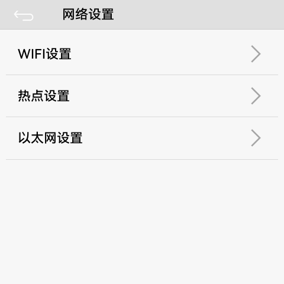

- 选 `WIFI设置` → 选 SSID → 输入密码 → 连接；
- 连上后返回设置页，WiFi 行会显示 `已连接 · <IP>`（本机样例：`已连接 · 192.0.2.108`）；
- 有线场景可直接用百兆网口，走 `以太网设置`。

### 3.3 时间与校时（NTP；**多屏拼接的前置条件**）

多屏拼接靠 UDP 广播的墙钟对齐相位，**各机时钟必须一致**；而面板 **RTC 是空的**（掉电不保时），
所以每次上电后**必须靠 NTP 把时间校回来**。

**校时怎么做的（2026-09-27 晚改造，v6）**

| 项 | 说明 |
|---|---|
| 时钟源 | ① **默认网关优先**（自动读 `/proc/net/route` 取默认网关，DHCP / 静态 IP 都适用）；② 网关不给 NTP 就落到**内置公网兜底列表**，逐个试到成功 |
| 公网兜底顺序 | `203.107.6.88`（阿里 s2）→ `120.25.115.20`（阿里 s2，实测最稳）→ `182.92.12.11` → `162.159.200.1` / `162.159.200.123`（Cloudflare，**时通时不通**）→ `216.239.35.0`（Google，国内不可达） |
| 精度 | 依赖包 **`ntp 2.1.1`**：回调 `timeval`、库内 `settimeofday` → **ms/µs 级**（旧版 `ntp 0.1.0` 回调是 `struct tm`，**只写整秒**，每台每次带 0~1 s 随机误差） |
| 刷新周期 | 上电重试到成功；成功后**每 30 分钟**刷新一次（原为"每天一次"） |
| 时区 | `TZ=UTC-8`（= 北京时间 UTC+8）；设置页显示 `GMT+08:00` |
| 日志 / 状态 | `ClockManager: TZ=UTC-8 gateway=<IP> servers[…]` → `ClockManager: synced via <server> … before=<ms> after=<ms> delta=<ms>`；设置页**时钟状态**显示 `时钟：NTP 已同步（<源>，每 30 分钟刷新）` / `时钟：等待 NTP 同步（第 N 次尝试）` |

**现场实测（2026-09-27，深圳办公网，两轮）**：`203.107.6.88` s2/42 ms、`120.25.115.20` s2/6 ms、
`182.92.12.11` s2/40 ms **稳定**；Cloudflare 时通时不通；Google / NIST / Apple **国内全超时**；
**办公网网关（H3C Miniware 192.0.2.1）不提供 NTP**（UDP 123 超时），`114.114.114.114` 也不提供。

**使用注意**

- 开机组网后请**等授时完成再进屏保**（否则可能被 `clock_insane` / 时钟可信门拦下、整墙不同步）；
- 校验：多台机器的屏保大时钟应显示同一分钟；拼接日志中 `now` 与 `epoch` 应在同一量级；
- **现场隐患**：面板 `/etc/resolv.conf` 的备用 DNS 是 **`8.8.8.8`（国内不可达）**，且面板是**固定 IP、没有 DHCP 客户端在跑** →
  主 DNS 一旦抽风会表现为"**网通但解析不了**"（就是"网关异常、连不上外网"那类现象）；改用 IP 直连的服务（NTP 兜底就是 IP）不受影响。

### 3.4 HA / MQTT 接入

**默认接入参数**（存在 `/data/preferences.json`，可被 `setMqttConfig` 覆盖）：

| 项 | 默认值 |
|---|---|
| Broker | **由现场提供**（键 `sp_mqtt_server`；地址/端口按项目现场填写） |
| 账号 / 口令 | **由现场配置**（键 `sp_mqtt_user` / `sp_mqtt_pass`）——**本手册不列出凭据** |
| 总开关 | `sp_mqtt_en = true` |
| 主题前缀 | `smartpanel/<deviceId>`，deviceId 即设备名（例 `PANEL-SAMPLE01` → `smartpanel/PANEL-SAMPLE01`） |

**主题约定**

| 方向 | 主题 | 载荷 |
|---|---|---|
| 上行（面板 → HA，retained） | `<prefix>/availability` | `online` / `offline`（LWT 兜底） |
| 上行 | `<prefix>/switch/relay_<1..3>/state` | `ON` / `OFF` |
| 上行 | `<prefix>/status` | 面板整体状态 JSON（name / ip / relays） |
| 下行（HA → 面板） | `<prefix>/switch/relay_<1..3>/command` | `ON` / `OFF` |
| 上行（HA Discovery，连接时发布） | `homeassistant/switch/<uid>/config` | 3 路灯开关的自动发现配置 |
| HA → 面板（情景清单） | `smartpanel/ha/scenes`（retained JSON） | `[{"id":"scene.x","name":"回家"}, …]` |
| HA → 面板（当前生效情景） | `smartpanel/ha/active_scene` | 情景 id，用于面板高亮 |
| 面板 → HA（点情景） | `<prefix>/ha_scene/set` | `<entity_id>`，由 HA 自动化执行 `scene.turn_on` |

**在 HA 里怎么用**：面板连上 broker 后会自动注册 3 个开关实体（`开关1/2/3`，名字取面板里的继电器名）；情景由 **HA 侧统一管理**（面板只展示 + 触发，不再自己定义情景按钮）。

> 状态唯一事实源是面板的 `RelayManager`：HA 下发、面板触摸、情景联动都改同一份状态，不会各说各话（这条是 9/27 修复的重点，见 §7）。

---

## 4. 界面总览与逐页说明

页面地图：`主页 ⇄ 屏保`，主页齿轮 → `设置`（上下滑动窗口）→ 各子页。

### 4.1 主界面（主页）


| 可点区域 | 位置（480×480 坐标） | 行为 |
|---|---|---|
| 齿轮 | 右上 `(428,18,34×34)` | 进设置 |
| 设备卡 1/2/3 | `(16,116,141×216)` / `(169,116,…)` / `(322,116,…)` | 单击开关该路继电器 |
| 情景 chip | 底部一行，`(16,388,100×60)` 起每 108 px 一个 | 单击执行情景；**长按 500 ms 编辑**该情景本机 3 路 |
| 左右滑动情景条 | 底部区域 | 翻页（多于 3 个情景时） |

> 实测：本机 3 个设备（客厅灯 / 灯带 / 茶台，均为「开启/关闭」文字状态）、3 个情景（回家 / 观影 / 睡眠）。

### 4.2 屏保

见 §2.1 图示。15 秒空闲进入；触摸任意处回主页。显示项与素材在「设置 → 屏保显示 / 屏保视频」里配。

### 4.3 设置页（顶部）

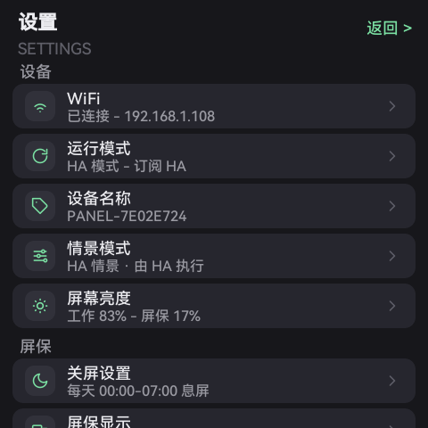

- 标题「设置 / SETTINGS」；右上「返回 >」回主页；
- 内容区**上下滑动**，分三组共 11 行：
  - **设备**：WiFi ｜ 运行模式 ｜ 设备名称 ｜ 情景模式 ｜ 屏幕亮度
  - **屏保**：关屏设置 ｜ 屏保显示 ｜ 屏保视频 ｜ 相册上传
  - **系统**：设备倒装 ｜ 版本信息 ｜ 多屏拼接
- 每行右侧显示**当前值**，单击进子页（「设备倒装」「多屏拼接」为即时切换 / 进页）。

### 4.4 设置页（滑到底）

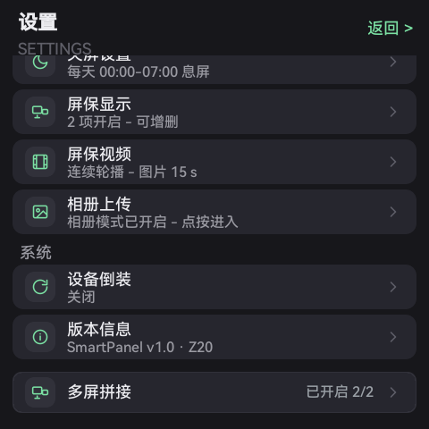

底部可见「系统」组的 **设备倒装**（值 `关闭`）、**版本信息**（`SmartPanel v1.0 · Z20`）、**多屏拼接**（值 `已开启 2/2`）。

### 4.5 运行模式

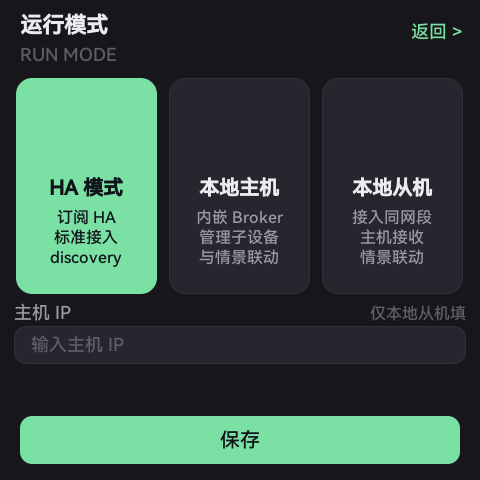

三张大卡单选，选中绿框 + 对勾；**切换即重建链路、掉电保持**：

| 模式 | 说明 |
|---|---|
| **HA 模式**（本机当前） | 外接 MQTT Broker 接入 Home Assistant：3 路 switch + availability + HA Discovery；情景从 HA 拉取、点按回推 HA 执行 |
| 本地主机 | 本机内嵌 MQTT Broker（`:1883`，免认证，按 128 连接设计），管理子设备与情景，无需外接服务器 |
| 本地从机 | 接入同网段的主机（页面有「主机 IP」输入框），上报自身状态、接收主机与情景下发 |

> 两套链路由运行模式**严格互斥**：同一时刻只有一个发布者。

### 4.6 情景模式

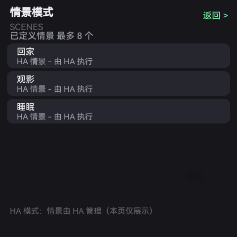

- 显示已定义情景列表（本机：**回家 / 观影 / 睡眠**，最多 8 个）与说明；
- **HA 模式下**页面提示「情景由 HA 管理（本页仅展示）」——增删请在 HA 侧维护，面板通过 `smartpanel/ha/scenes` 拉取。

### 4.7 屏幕亮度

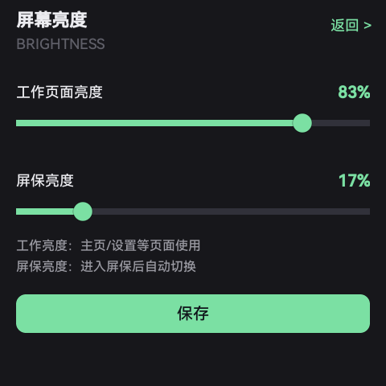

- 两个滑块：**工作页面亮度**（主页/设置用，本机 83%）、**屏保亮度**（进屏保自动切换，本机 17%）；
- 保存即落盘（`sp_bright_work` / `sp_bright_ss`）。

### 4.8 关屏设置

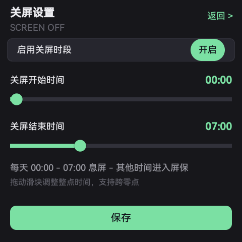

- 开关「启用关屏时段」+ 两个整点滑块（**关屏开始 / 关屏结束**，支持跨零点）；
- 本机样例：`每天 00:00 – 07:00 息屏 · 其他时间进入屏保`；
- 起止相同会红字提示并阻止保存。

### 4.9 屏保显示

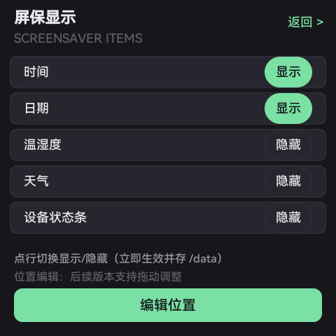

- 5 个显示项开关，点行即切换、立即生效并落盘：**时间 / 日期 / 温湿度 / 天气 / 设备状态条**（本机开：时间、日期）；
- 「编辑位置」按钮 → 屏保编辑模式（拖动调整各元素位置，位置持久化 `sp_ss_pos_*`）。

### 4.10 屏保视频

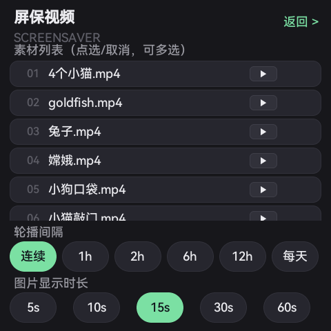

- 素材列表（本机 `01 4个小猫.mp4`、`02 goldfish.mp4`、`03 兔子.mp4`、`04 嫦娥.mp4`、`05 小狗口袋.mp4` …，可多选）；
- **轮播间隔**：连续 / 1h / 2h / 6h / 12h / 每天（本机=连续）；
- **图片显示时长**：5s / 10s / 15s / 30s / 60s（本机=15s）。

### 4.11 相册上传


- 状态卡：**相册模式已开启** + 呼吸灯，提示「等待手机 APP 上传 · 同一局域网自动发现」；
- **二维码**：手机微信扫码传图（手机与面板需在同一 WiFi）；
- 计数：图片 JPG/PNG — 3 个；视频 MP4 — 2 个（本机实测）；
- 底部：「**文件管理**」进相册文件页，「**结束相册模式**」退出。

### 4.12 相册文件


- 标题「相册文件管理 / ALBUM FILES」，顶部 `共 5 个文件 · 已选 0 个`；
- 3×N 缩略图网格（图片直接显示，视频带播放角标）；
- 底部：**全选 / 删除所选 / 完成**（删除有二次确认）。

### 4.13 设备名称

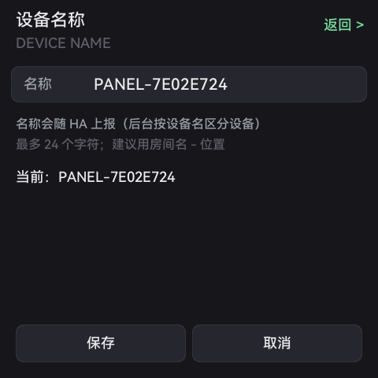

- 输入框改设备名（**最多 24 字符**，建议「房间名 - 位置」）；
- 本机当前 `PANEL-SAMPLE01`；名称会随 HA 上报，后台按设备名区分设备；
- 保存 / 取消。

### 4.14 版本信息

**没有子页**。设置页「版本信息」行右侧直接显示版本号（本机：`SmartPanel v1.0 · Z20`），点击无动作。

### 4.15 多屏拼接页

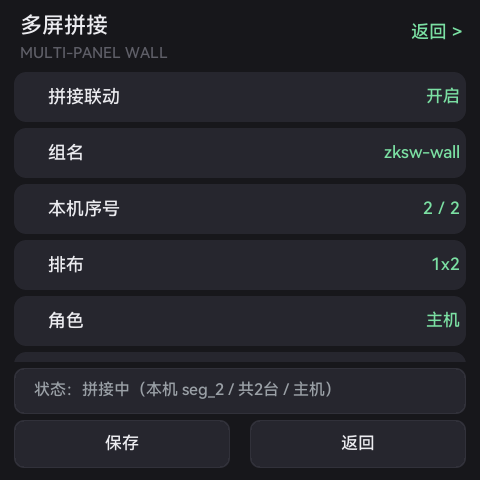

6 行参数（第 6 行需在页内下滑可见）：

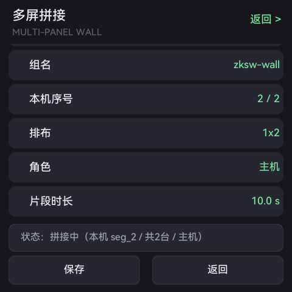

本机实测值（**v2 前**截图）：`拼接联动=开启`、`组名=zksw-wall`、`本机序号=2/2`、`排布=1x2`、`角色=主机`、`片段时长=10.0 s`；
底部状态卡：`状态：拼接中（本机 seg_2 / 共2台 / 主机）`。

> **v2 起的文案变化**：②「组名」点一下 = 在 `/mnt/sdnand/wall` 下**真实存在的组目录**之间循环（**组名 = 目录名，可自定义**）；
> ⑥那一行改叫「**播放内容**」，显示 `K 段 · 总 X.Xs`（一组多视频轮播）；状态卡多出 `K 段轮播` 字样。
> 逐项含义与排障 → **§6 与 `docs/说明书-多屏拼接.md`**。

---

## 5. 设备倒装（180°）

**用途**：面板被倒装（上下颠倒）安装时（天花板下沿、倒置支架），一次点击把 **UI + 触摸 + 视频** 全部旋转 180°，不用改工程、不用重做素材。

**位置**：设置页 →「系统」组 → **设备倒装**（在「版本信息」上一行）。

| 项 | 说明 |
|---|---|
| 取值 | `关闭` / `开启 · 整屏已转 180°`（点击即切换、**立即生效**、**掉电保持**） |
| 键 | `sp_flip180`（bool，默认 `false`；`true`/`1` 都认） |
| 三路一起转 | ① 整屏 UI 旋转 180°（`easyui setScreenRotate(180)`）② 触摸坐标同角度映射（`setTouchRotate(180)`）③ **视频图层**旋转（MI DISP 图层级旋转，对屏保与拼墙两条播放链路都生效） |
| 切换顺序 | 先落盘 → 停播放器（MI 图层属性不能在播放中改）→ 转 UI/触摸 → 转视频层，播放器由屏保心跳按新旋转重起 |
| 开机 | 每次上电按 `sp_flip180` 重新应用，不会「设了重启又变正」 |
| 对拼墙影响 | **无**：两台相位差、画面块度与开启前一致（实测相位 |Δ| max 0 ms、块度 1.04~1.18） |
| 与素材朝向的关系 | 面板是 **480×480 正方形**，所以只转 UI 即可，**素材（视频/图片）不需要预旋转**；若把面板装成 90° 侧装则另说（本功能只管 180°） |

**关闭（原状态）→ 开启 对比**（同一页、同一滚动位置）：

| 关闭 | 开启（整屏 180°） |
|---|---|
|  | 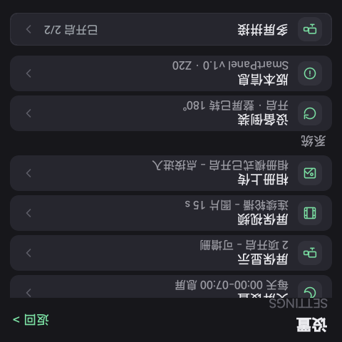 |
| 行值 `关闭`，画面正立 | 行值 `开启 · 整屏已转 180°`，画面上下颠倒 |

> ⚠️ **截屏只能验证 UI 层**：视频图层不在 `/dev/fb0`，所以「视频有没有跟着转」用截屏看不到，请用**相机拍屏**确认。设备侧客观自证：读 `/proc/mi_modules/mi_disp/mi_disp0` 里 `LayerId 0 … rotatemode`（开 = `rotate_180`，关 = `NONE`）。

---

## 6. 多屏拼接

> 完整说明（原理、素材准备、逐项参数、排障、高阶键）见 **`docs/说明书-多屏拼接.md`**，本节只给「3 步上手 + 验收判据」摘要，不复述。

**支持两种素材形态**：① 单段视频（旧布局：组目录下直接放 `seg_<序号>.mp4`）；② **一组多视频轮播（v2）**——
组目录里放 `playlist.json` + `c1/…cK/seg_<序号>.mp4`，**各 clip 时长不限**（实测：鱼缸 10.04 s + 马里奥 235.88 s，一轮 245.92 s），
播完一个 clip 直接 reopen 下一个（不 seek、轮末不留空档），播完最后一个回到第一个；
**组名 = 目录名，可自定义** —— 设置页「组名」行会在盘上真实存在的组之间循环，⑥行显示 `K 段 · 总 X.Xs`。

### 3 步上手

1. **备素材**：用切块工具（`tools/video_wall/`，网页 `http://<PC>:8796/`）生成组目录，再推到**每台**机器
   `/mnt/sdnand/wall/<组名>/` 下：单段 → 直接放 `seg_<本机序号>.mp4`；多 clip → `c1/seg_<本机序号>.mp4` …
   - 一条命令出多 clip 组：`python split_wall.py group --in a.mp4 --in b.mp4 --cols 2 --group-name <组名> --out-dir out/g1`；
   - 推送：`python distribute.py push --group-dir out/g1 --group <组名> --devices 192.0.2.108=1,192.0.2.71=2`
     （设备盘仅 **75 MB** 时加 `--only-mine`：每台只存自己要播的那一段）；
   - **同一 clip 内**各机那段必须**等长、参数完全一致**（不同 clip 之间可长短不同）。
2. **配参数**：设置 → 滑到底 →「多屏拼接」，6 行逐项点击（立即落盘）：
   ①拼接联动=开启 → ②组名（**各机相同**，选盘上真实存在的组）→ ③本机序号（**每台唯一**）→ ④排布（总台数）→ ⑤角色（**序号 1 设主机，其余从机**）→ ⑥播放内容（**只读**：`K 段 · 总 X.Xs`）。
3. **进屏保**：等 15 秒空闲自动进屏保，各机应同帧播放同一画面。

### 验收判据

| 项 | 判据 |
|---|---|
| 相位同步 | 两机 `|Δnow|` **≤ 40 ms**（1 帧），连续多轮（实测基线 max 3 ms） |
| 多 clip 轮播切换/回卷 | 两台切换（含回卷到第 1 个 clip）时刻 **Δ ≤ 1 ms**、同一帧（实测 0~1 ms） |
| 画面质量 | 设备抓帧「块度」**≤ 1.2**（实测基线 1.08~1.17；多 clip 组实测中位 1.07/1.00） |
| 素材一致 | **同一 clip 内**各机 `seg_<序号>.mp4` 时长差 ≤ 40 ms；单 clip 模式另需 `sp_wall_seg_ms` = 素材真实时长 |
| 版本一致 | 各机 `/res/lib/libzkgui.so` md5 相同；`/res/ui/*.ftu` 与出包一致 |
| 运行状态 | `getprop sys.zkapp.state` = `running` |

---

## 7. 常见问题（FAQ）

### 7.1 HA 下发能到、状态不回 / 开关「一会儿又切回去」

- **原因（已修，2026-09-27）**：三处叠加 —— ① HA 命令的监听被别的订阅覆盖；② `status` 里的继电器状态恒为 `false`；③ retained 旧状态在重连后被重新灌回。
- **现象**：HA 里点开 → 面板亮了 → 一两秒后又变回关；或 HA 里实体状态一直显示关闭。
- **已修后的行为**：状态唯一事实源 = 面板 `RelayManager`，触摸 / 情景 / HA 命令都改同一份状态，再把 `state`（retained）稳定回推。
- **若再遇到，这样自查**：
  1. 电脑上订阅 `smartpanel/<设备名>/#`（例 `smartpanel/PANEL-SAMPLE01/#`），看 `switch/relay_1/state` 是否随操作变化；
  2. 比对 broker 里该主题的 **retained** 值与面板实际状态是否一致（不一致 = 有旧 retained 残留，重新发布一次即可）；
  3. 看面板侧日志有无重复连接 / 模式互斥冲突（HA 模式与本地主机/从机**互斥**，别同时开）。

### 7.2 推了新包但设备看起来没变

**第一件事**：检查 **SD 卡上 `/mnt/extsd/EasyUI.cfg` 的 `startupLibPath` 是不是在劫持**。

- 该文件若把 `startupLibPath` 指到别的目录（或指向 SD 卡上的旧副本），系统就加载那份**旧库/旧界面**，你推的新包等于白推；
- 处置：先把 `/mnt/extsd/EasyUI.cfg` 里的 `startupLibPath` 改回（或删掉该文件，让它走板载默认），再重启应用；
- 另一条同类坑：**双启动位**——确认 `sys.zkapp.state=running` 且 `/res/ui/*.ftu` 的 md5 与你出的包一致（`adb pull` 下来在本机算 md5，设备侧无 `md5sum`）。

### 7.3 屏保 / 拼墙有黑边、素材切法疑问

用视频墙切图工具（**PC 侧**，别手切）：

- 目录 `tools/video_wall/`，网页版：`http://<PC_IP>:8796/`；
- `split_wall.py` 负责「按台数等分 + **去黑边裁切**」，`selfcheck_crop.py` 自检，`distribute.py` 分发到各机；
- 切完的片段仍要满足 §6 的「各机等长、时长 = `sp_wall_seg_ms`」。

### 7.4 设备侧命令不全 / adb 连不上

| 现象 | 处置 |
|---|---|
| `grep / sed / id / df -h / md5sum` 都 `not found` | 设备精简 rootfs。push 静态 BusyBox：`tools/busybox/bin/z20/busybox`、或 `tools/FlyThings_mcp_open/bin_tools/z20/busybox`，`chmod 777` 后用 `busybox grep …` |
| `adb shell/push/pull` 全报 `error: closed` | 少数板（如 F135/F136）出厂 adb 未授权：**先进一次交互式 `adb shell` 完成登录**（账号口令由厂家/现场提供，**本手册不列出**），之后 push/pull 才通。**Z20 面板一般不需要**（108/153/154 实测直接可用） |
| 抓屏 / 触摸 | 抓屏用 MCP `flythings_device_screenshot`（不要手搓 `screencap`/`cat /dev/fb0`）；触摸注入用 `bin_tools/z20/touch`（push 到 `/tmp` 后 `tap/swipe`；本板触摸节点 `event0=chipone-ts`，**单点协议**） |

### 7.5 画面块噪 / 花屏

**根因是解码通道属性**，不是素材也不是屏。

- 正确口径：**输出口深度 2 MB**、**`RefFrmNum=16`**、缓存模式 **`NORMAL`**（旧口径 512 KB / `RefFrmNum=1` / `INPLACE` 会出块噪）；
- 修复前后实测：设备帧块度 **1.53~1.81 → 1.08~1.17**；
- 细节 → `references/kb/z20-mi-vdec-channel-attrs.md`。

### 7.6 其他常见问题

| 现象 | 先查 | 处置 |
|---|---|---|
| 两台各播各的、不同步 | 组名是否一致、是否同 NTP 源、是否**只有一台**主机 | 改配置 → 停/启应用；看日志 `wall: start target=…` |
| 拼墙画面错位半屏 | 本机 `seg_<序号>.mp4` 是否放对；解码通道块度 | 见 §7.5 |
| 播放卡住只出一帧 | 日志 `content != period`（素材时长 ≠ `sp_wall_seg_ms`） | 对齐素材时长 |
| 进屏保半天不同步 | UDP 广播是否被交换机拦（广播抑制/客户端隔离） | 关掉交换机隔离，或换傻瓜交换机验证 |
| 一直 `clock_insane` 不播 | 是否已授时 | 等 NTP 同步；该守卫只拦「未来 >1h」的脏 epoch |
| 设置页某行点不进去 | 装饰层吃掉了按下事件 | 升级到当前版本（09-27 已修，含「多屏拼接」行） |
| 升级/推包后画面异常 | 运行中重启可能卡 MI 驱动 | 断电重上电整板恢复；避免连续反复重启 |

### 7.7 两块屏画面差一截（轮播不同步 / 差几帧到十几帧）

**先看两台校时、再看钟差** —— 绝大多数“差一截”是钟差，不是播放器。

| 步骤 | 查什么 | 判据 / 处置 |
|---|---|---|
| ① 两台是否完成 NTP | 设置页时钟状态 / 日志 `ClockManager: synced via …`（见 §3.3） | 两台都应显示“已同步”；未同步 → 等它校完再进屏保 |
| ② 面板 RTC 是空的 | `/proc/driver/rtc` 显示 1970-01-01 = 掉电不保时 | 属**正常硬件事实** → 每次上电必须靠 NTP 校回来 |
| ③ 钟差多大 | 拼接日志 `skew`（固件取**近 5 次中值**，只丢 `|skew|>120 s` 的脏样本） | 单台绝对误差 **≤100 ms**、两台互差 **≤50 ms**（**待验证数据（占位）**） |
| ④ 播放器相位 | `wall[sp]: sync cyc=… pts=… want=… now=…`，按同一 `cyc/pts` 配对 | 两台 `|Δ|` ≤ 40 ms（1 帧） |

> 背景：旧版 `ntp 0.1.0` **只写整秒** → 两台每次校时各带 0~1 s 随机误差（实测 108 慢 643 ms、71 慢 1060 ms、
> **两台互差 416 ms ≈ 10 帧**）；而播放器里“`|skew|>200 ms` 当垃圾丢弃”的保险会把这个真实钟差一并丢掉。
> v6 已改为 **ms 级校时 + 中值滤波 + ±120 s 门限**，并对“墙钟 < 2024-01-01（未校时）”加了时钟可信门（先等 NTP，最长 30 s）。

### 7.8 “推上去没变化” / “组名行循环不到我建的组”

- **推上去没变化 → 先查 `/mnt/extsd/EasyUI.cfg`**：`startupLibPath` 劫持会把新包顶掉 → 详见 **§7.2**。
- **组名循环不到我建的组 / ⑥显示 `未设置`**：①组目录是否真在 `/mnt/sdnand/wall/` 下（大小写一致）
  ②整组（含 `playlist.json`）是否推上去了 → 用切块工具重推整组；状态行会提示 `未找到组目录（请先用切块工具生成）`。

---

## 8. 参数速查表

> 全在设备 `/data/preferences.json`（改完**重启应用**生效）。下表「当前值」取自本机 192.0.2.108 实测。

### 8.1 继电器 / 情景

| 键 | 当前值 | 含义 |
|---|---|---|
| `sp_device_id` | `PANEL-SAMPLE01` | 设备名/设备 ID（HA 上报、MQTT 主题前缀都用它） |
| `sp_relay_name1/2/3` | 客厅灯 / 灯带 / 茶台 | 三路继电器显示名 |
| `sp_relay_state` | `3` | 继电器状态**位掩码**（bit0=1 路，bit1=2 路，bit2=3 路；3 = 第 1、2 路开） |
| `sp_scene_json` | （见下） | 本机情景定义（名称 + 三路目标状态 + 描述） |

本机 `sp_scene_json`（HA 模式下情景实际由 HA 管理，此处为本地兜底）：

```json
{"home":  {"relays": [true,  true,  false], "desc": "回家模式: 客厅灯+灯带开"},
 "away":  {"relays": [false, false, false], "desc": "离家模式: 全部关闭, 安防联动"},
 "sleep": {"relays": [false, false, true ], "desc": "睡眠模式: 仅氛围灯开"},
 "relax": {"relays": [false, true,  false], "desc": "休闲模式: 仅灯带开"}}
```

### 8.2 屏 / 亮度 / 关屏

| 键 | 当前值 | 默认 | 含义 |
|---|---|---|---|
| `sp_bright_work` | 83 | — | 工作页面亮度 % |
| `sp_bright_ss` | 17 | — | 屏保亮度 % |
| `sys_brightness_key` | 17 | — | 系统当前亮度档 |
| `sp_off_en` | 1 | — | 关屏时段启用（1/0） |
| `sp_off_start` / `sp_off_end` | 0 / 7 | — | 关屏起止整点（本机 00:00–07:00，支持跨零点） |
| `timeZone` | `GMT+08:00` | — | 时区 |

### 8.3 屏保显示 / 素材

| 键 | 当前值 | 含义 |
|---|---|---|
| `ss_item_time` / `ss_item_date` | 1 / 1（默认开） | 屏保显示「时间 / 日期」 |
| `ss_item_temphum` / `ss_item_weather` / `ss_item_statusbar` | 0 / 0 / 0 | 屏保显示「温湿度 / 天气 / 底部设备状态条」（本机全关） |
| `sp_ss_pos_time_x/y`、`sp_ss_pos_date_x/y` | 99,0 / 106,105 | 屏保时钟/日期位置（编辑位置后落盘） |
| `sp_photo_sec` | 15 | 屏保里**每张图片显示秒数** |
| `sp_video_int` | 0 | 轮播间隔档（0=连续） |
| `sp_video_sel` | `/mnt/sdnand/wall/zksw-wall/seg_2.mp4` | 当前选中素材（本机屏保在放拼墙片段 2） |
| `sp_album_mode` | 1 | 相册模式（1=开启，等待手机上传） |
| `sp_mp_appid` / `sp_qr_url` / `sp_qr_img_url` | `wxb6c754ef717599d1` / — | 相册上传小程序的 appid 与二维码 |

### 8.4 多屏拼接

| 键 | 当前值 | 默认 | 含义 |
|---|---|---|---|
| `sp_wall_en` | true | false | 拼接总开关 |
| `sp_wall_group` | `zksw-wall` | `zksw-wall` | 组名（同组各机必须一致）**= 设备上 `/mnt/sdnand/wall/` 下的目录名，可自定义** |
| `sp_wall_idx` | 2 | 1 | 本机序号（每台唯一，决定播放 `seg_<序号>.mp4`） |
| `sp_wall_n` | 2 | 2 | 总台数（2~4，单行横排 `1xN`） |
| `sp_wall_role` | 1 | 1 | 角色：1=主机（时间权威）/ 0=从机 |
| `sp_wall_seg_ms` | 10040 | 30000 | 片段时长 ms（**单 clip 模式**必须等于素材真实时长；多 clip 模式时间轴以 `playlist.json` 的 `total_ms` 为准） |
| `sp_wall_engine` | 1 | 0 | 播放内核：0=v4（easyui 播放器）；1=simple（自读包 + I 帧追赶） |
| `sp_wall_join` | — | true | 进屏保「先对齐再跳画面」 |
| `sp_wall_join_to_ms` | — | 5000 | 进屏保等 epoch 超时 ms |
| `sp_wall_lead_ms` | — | 0 | 起播提前量 |
| `sp_wall_vdec_ch` / `sp_wall_disp_ch` | — | 1 / 1 | MI 通道对（失败自动回退） |
| `sp_wall_rotate` | — | 0 | 本机画面旋转角（多台须统一） |
| `sp_wall_clock_wait_ms` | — | 30000 | **时钟可信门**：本机墙钟 < 2024-01-01（掉电 RTC 空 / 未校时）时先等 NTP，最长等这么久 |

### 8.5 设备倒装 / MQTT

| 键 | 当前值 | 默认 | 含义 |
|---|---|---|---|
| `sp_flip180` | false | false | **设备倒装**：整屏 UI + 触摸 + 视频层 180°，掉电保持 |
| `sp_mqtt_en` | true | true | HA/MQTT 接入总开关 |
| `sp_mqtt_server` | （默认）| 内网 Broker 地址（现场填） | 外接 Broker 地址 |
| `sp_mqtt_user` / `sp_mqtt_pass` | 空 | （现场配置，**本手册不列出**） | Broker 账号口令 |
| `sp_set_rotate` | — | — | 保留键（设置页角度相关，未启用） |

---

## 9. 验收口径

| 项 | 判据 | 复核方法 |
|---|---|---|
| 拼接相位同步 | 两机 `|Δnow|` **≤ 40 ms**（= 1 帧），连续多轮 | 两机 `logcat` 抓 `wall[sp]: sync cyc=… pts=… want=… now=…`，按同一 `cyc/pts` 配对求差；实测基线 max 3 ms |
| 多 clip 轮播切换 | 切换/回卷时刻两台 **Δ ≤ 1 ms**，且 `dropGop=0` | 两机 `playlist clip-switch` / `playlist wrap` / `reopen(…)` 日志配对 |
| 校时 / 钟差（**待验证**） | 单台绝对误差 **≤100 ms**、两台互差 **≤50 ms** | `logcat` 抓 `ClockManager: synced via …` 与拼接 `skew`（近 5 次中值）；**v6 改后数字待补** |
| 画面质量 | 设备抓帧「块度」**≤ 1.2** | 设备端 `zkshot <out.raw> vdec <chn> 0` 抓 YUV，按 16 像素边界算块度；实测 1.08~1.17 |
| so / ftu 一致 | 设备 `/res/lib/*.so`、`/res/ui/*.ftu` 的 **md5 与出包完全一致** | 设备无 `md5sum` → `adb pull` 回 PC 算 md5 比对 |
| 运行状态 | `getprop sys.zkapp.state` = **`running`** | adb |
| 版本一致（多机） | 各机 `/res/lib/libzkgui.so` md5 相同 | 同上 |
| 上电自恢复 | 倒装 / 运行模式 / 亮度 / 关屏 掉电后保持 | 断电重上电复核 |

---

## 10. 版本与变更（2026-09-25 ～ 09-27）

| 日期 | 变更 |
|---|---|
| 2026-09-25 | **拼接联动 v1** 落地：UDP epoch 广播 + 整边界起播；分组/序号/排布/角色/片段时长 6 行配置；屏保素材混播（视频 + 相册图片，图片 15 s） |
| 2026-09-26 | 墙钟改 `clock_gettime` 毫秒精度；新增 `wall?` 点播快通道；**两段式起播 + 自校准** → 相位收敛到 ≤19 ms；新增 simple 引擎（自读包 + I 帧追赶）；进屏保「先对齐再跳画面」；设置页行命中修复 |
| 2026-09-27 | **解码通道属性修复**（512 KB / RefFrmNum=1 / INPLACE → **2 MB / 16 / NORMAL**）：块噪花屏根治，块度 1.53~1.81 → **1.08~1.17** |
| 2026-09-27 | 设置页 11 行箭头统一 26 宽；「多屏拼接」行补左侧图标并整行可点 |
| 2026-09-27 | **新增「设备倒装」开关**（设置 → 系统）：整屏 UI + 触摸 + 视频层 180°，掉电保持；拼墙相位/块度实测不退化 |
| 2026-09-27 | **HA/MQTT 修复**：监听被覆盖 + `status` 恒 false + retained 旧值回灌 → 统一以 `RelayManager` 为唯一事实源 |
| 2026-09-27 | **视频墙切图/去黑边工具**（`tools/video_wall`，网页 `http://<PC>:8796/`）上线，替代手工切分 |
| 2026-09-27 晚 | **多屏拼接 v2：一组多视频轮播 + 组名自定义**——组目录 = `playlist.json`(v2) + `c1..cK/seg_1..N.mp4` + `wall.json`(v1 壳)；时间轴 `pos = g mod total_ms`，**各 clip 长短不限**；clip 末尾 reopen 下一段（不 seek、不留空档）；旧布局继续兼容；UDP 广播末尾追加 `\|clips\|total_ms`（老从机只读前 6 段）；设置页「组名」改为在盘上真实组目录间循环、⑥改为「播放内容」`K 段 · 总 X.Xs`。实测（108/71，组 `fish-mario`）：回卷 Δ=0~1 ms、同帧、块度中位 1.07/1.00 |
| 2026-09-27 晚 | **校时改造（NTP v6）**：`ntp 0.1.0 → 2.1.1`（回调 `timeval` → **ms/µs 级**）；时钟源 = **默认网关（`/proc/net/route`）+ 公网兜底**逐个试；成功后**每 30 分钟**刷新（原每日一次）；拼接侧钟差改**近 5 次中值** + 只丢 `\|skew\|>120 s` 脏样本；新增「墙钟 <2024-01-01 先等 NTP（≤30 s）」时钟可信门（§3.3、§7.7）。**改后实测数字待验证（占位）** |

---

## 附录 A：本手册截图清单（真机）

设备：**192.0.2.108:5555**（`Zkswe_SSD20X_SPINOR`，480×480）｜抓取日期：**2026-09-27 午间**｜目录：`docs/manual_shots/`

| 文件 | 对应页面 | 抓取时间 |
|---|---|---|
| `01_屏保.png` | 屏保（UI 层 + 视频层真机帧按图层合成） | 12:22 |
| `01b_屏保_背景视频层抓帧.png` | 屏保背景视频层**原始抓帧**（vdec chn1） | 12:23 |
| `01c_屏保_UI层抓帧.png` | 屏保 UI 层**原始抓帧**（fb0） | 12:22 |
| `02_主界面.png` | 主界面（主页） | 12:22 |
| `03a_设置页_顶部.png` | 设置页（顶部） | 12:21 |
| `03b_设置页_滑到底.png` | 设置页（滑到底，含设备倒装/版本信息/多屏拼接） | 12:22 |
| `04_多屏拼接.png` | 多屏拼接页（第 1–5 行 + 状态卡） | 12:16 |
| `04b_多屏拼接_下拉看第6行.png` | 多屏拼接页（下拉，露出第 6 行；**v2 起该行文案为「播放内容 K 段 · 总 X.Xs」**） | 12:33 |
| `05_运行模式.png` | 运行模式 | 12:21 |
| `06_情景模式.png` | 情景模式 | 12:21 |
| `07_屏幕亮度.png` | 屏幕亮度 | 12:21 |
| `08_关屏设置.png` | 关屏设置 | 12:21 |
| `09_屏保显示.png` | 屏保显示 | 12:22 |
| `10_屏保视频.png` | 屏保视频 | 12:22 |
| `11_相册上传.png` | 相册上传 | 12:22 |
| `12_相册文件.png` | 相册文件管理 | 12:22 |
| `13_设备倒装_开启.png` | 设备倒装 = 开启（同页对比） | 12:23 |
| `14_设备倒装_关闭.png` | 设备倒装 = 关闭（原状态） | 12:22 |
| `15_设备名称.png` | 设备名称 | 12:23 |
| `16_WiFi设置.png` | 系统网络设置页（WiFi 配网入口） | 12:23 |

**未取得 / 未包含的图**

| 图 | 原因 |
|---|---|
| 版本信息**子页** | 该功能**没有子页**：设置页「版本信息」行右侧即版本号，点击无动作（源码 `onButtonClick_ButtonRowVer` 只打日志）。故只提供设置页行截图。 |
| 屏保背景视频的「合成原图」 | 视频在**独立硬件图层**，系统截屏只取 UI 层（fb0）。已提供 UI 层 + 视频层两路原始抓帧（`01b`/`01c`）供核对，合成为按图层关系叠加。 |
| 设备倒装的「视频方向」证据 | 同上：视频层不在 fb0，截屏看不到旋转。需**相机拍屏**，或用 `/proc/mi_modules/mi_disp/mi_disp0` 的 `rotatemode` 自证。 |
| HA 侧页面（开关实体 / 自动化） | 需访问 HA Web 或 MQTT broker 侧，本次设备只读取证未接入 HA 后台，**图待补**。 |
| 手机扫码上传界面 | 需手机 + 微信小程序实际操作，PC 侧无法抓取，**图待补**（面板侧二维码见 `11_相册上传.png`）。 |

## 附录 B：本次取证对设备的改动说明

本次以「真机截图」为目的，全程**只读**，仅做了一处必要验证并已完全恢复：

1. **设备倒装开关**：为拍 ON/OFF 对比，点了一次「设备倒装」→ 截图 → **再点一次恢复**；
   已核对 `/data/preferences.json`：`sp_flip180 = false`（与取证前一致）。
2. 触摸导航过程中误触了两下主页设备卡（`sp_relay_state` 由 3 变 1），**已点回并核对 `sp_relay_state = 3`**（与取证前一致）。
3. 其他参数（`sp_wall_*`、亮度、关屏、相册、素材）**全部未改动**。
4. 设备侧临时候命工具已清理：`/tmp/touch`、`/tmp/zkshot`、`/tmp/f*.raw` 已删除（`/tmp/busybox` 为抓屏工具自带，保留）。

## 附录 C：待补（占位，等实测回收）

| # | 待补项 | 判据 | 状态 |
|---|---|---|---|
| 1 | **NTP v6 改后的实测数字**（校时后进屏保：单台绝对误差 / 两台互差） | 单台 **≤100 ms**、两台互差 **≤50 ms** | **待验证数据（占位）** —— 另一条线正在给 108/71 推固件验证；回收后补 §3.3 / §7.7 / §9 对应格 |

> 本手册其余数字（相位 ≤3 ms、块度 1.08~1.17、多 clip 回卷 Δ=0~1 ms / 块度中位 1.07·1.00、NTP 兜底源实测）均为现场实测。
